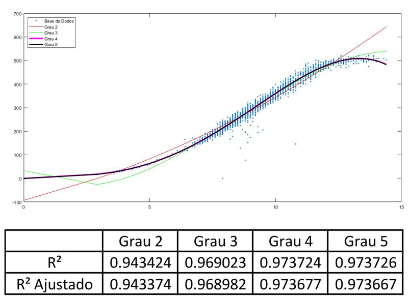

#### REGRESSÃO POLINOMIAL. Usando o conjunto de dados do aerogerador (variável de entrada: velocidade do vento – m/s, variável de saída: potência gerada – kWatts), determine os modelos de regressão polinomial  (graus  2,  3,  4  e  5)  com  parâmetros  estimados  pelo  método  dos  mínimos quadrados. Avalie a qualidade de cada modelo pela métrica R² e R²ajustado.
> . / codes / regressaoPolinomial.m

  

